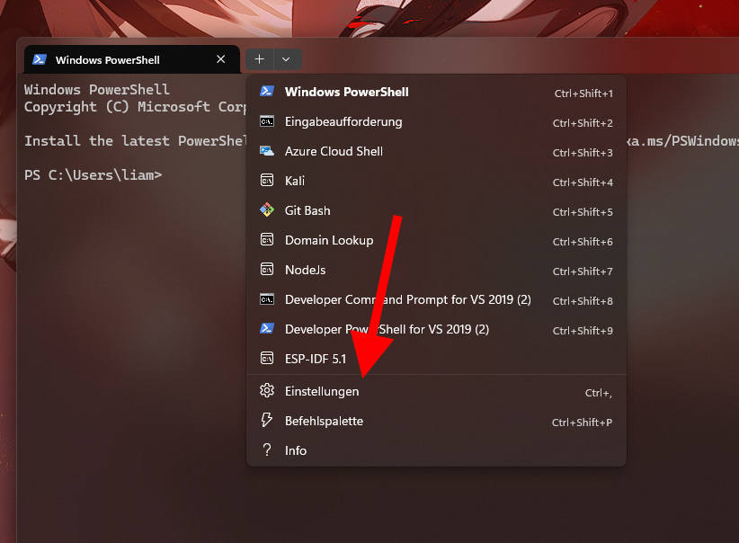
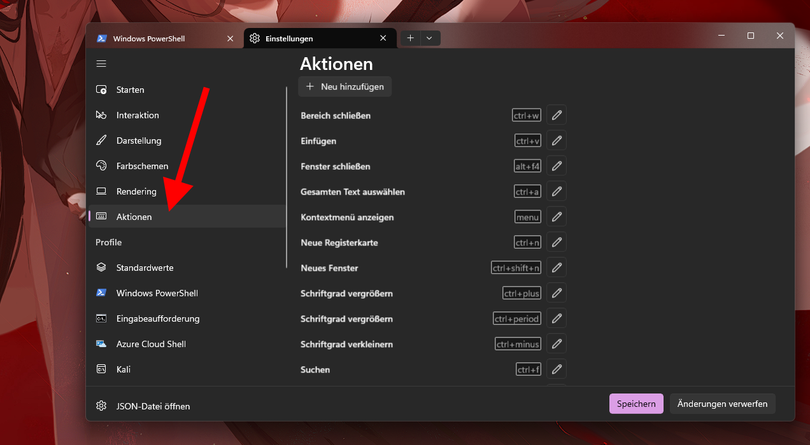
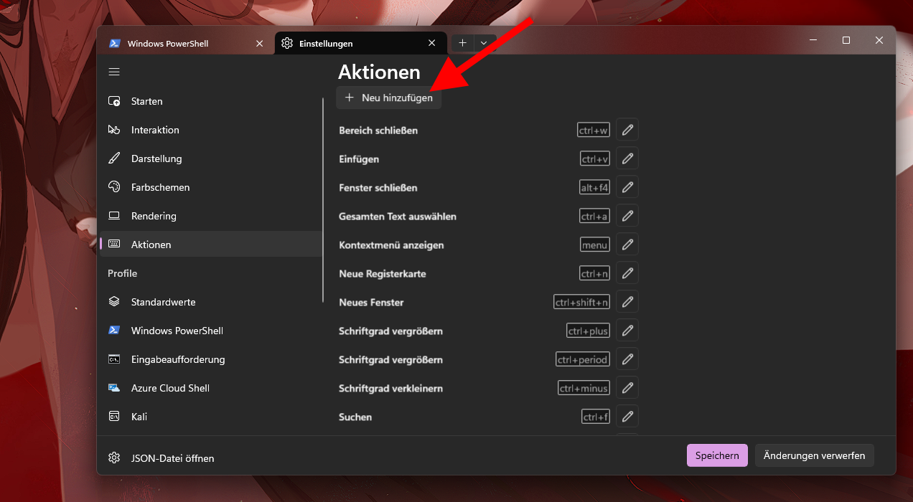
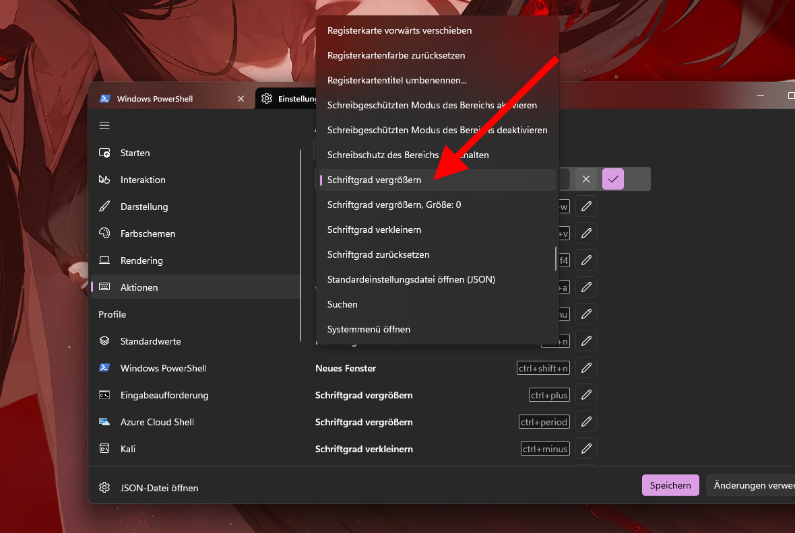
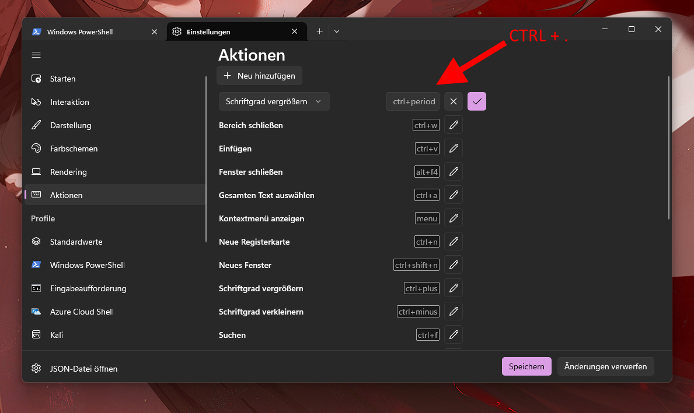
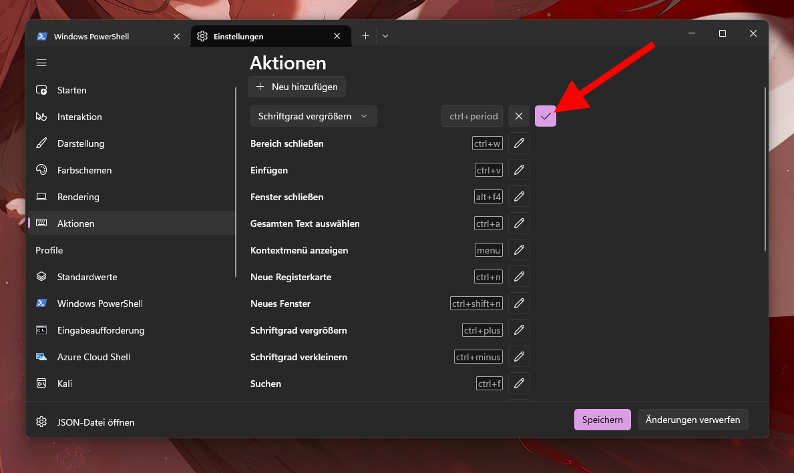
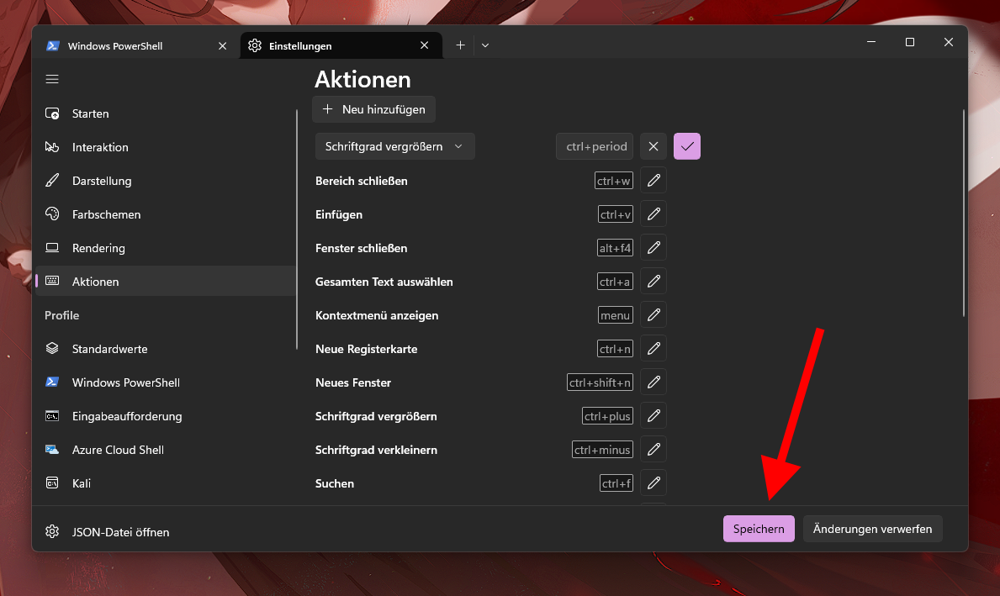

# Image & Video Viewer by DNA

Hello,
this is a project I made just for fun, which allows you to view images and from now on videos too in the terminal. Written in TypeScript with [Deno](https://deno.land/)

## How to use

- I recommend using Windows-Terminal
- In Windows-Terminal, in order to get the automatic zoom (for better resolution) working, you'll need to create a specific keybind.

```powershell
deno run -A img.ts <path to image>
      -> deno run -A img.ts C:\Users\DNA\Downloads\Test.png
      -> deno run -A img.ts test.png

deno run -A video.ts <path to video>
      -> deno run -A video.ts C:\Users\DNA\Downloads\Test.mp4
      -> deno run -A video.ts test.mp4
```

- To exit, press any key
- For `video.ts`, you can press `F1` in to open info menu

### Setting up Windows-Terminal









## Upcoming features
### Video Viewer
1. Nicer way of changing FPS-limit
0. Sync framerate with video
0. Add audio